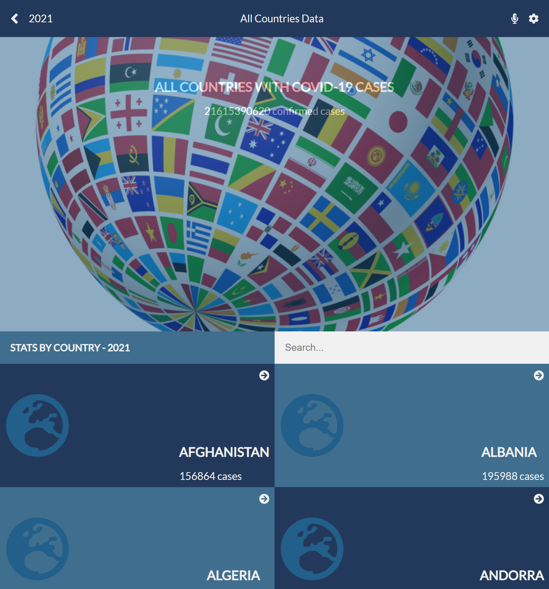

# Covid-19-Tracking-Project

> A mobile web application to check a list of Countries with covid-19 cases. The application has two pages. Homepage displays a list of Countries that could be filtered by Country's name. The detail page shows details for all regions with total number of confiremd cases.

### Countries (Homepage)

### Regions (detail page)

## Built With

- ReactJS
- Redux

## Live demo

[Covid-19-Tracking-Project](https://compassionate-hamilton-ee5949.netlify.app/)

## Video Presentation
[Check my video presentation here](https://www.loom.com/share/2ee0bcacd5c04077a0a978a24d1f5a86)

## Getting Started

### To get a local copy, run the following steps:

- Copy this link `git@github.com:julie-ify/covid-19-tracking-project.git`
- Open your terminal or command line
- Run `git clone` and paste the link
- Open the folder with your code editor
- Create a branch to work on
- Run `npm install`
- Run `npm start` to launch the server.
- Run `npm test` to run all tests.

## Author

👤 **Juliana Ifionu**

- GitHub: [@julie-ify](https://github.com/julie-ify)
- LinkedIn: [Juliana Ifionu](https://www.linkedin.com/in/juliana-ifionu-4a9492212/)

## 🤝 Contributing

Contributions, issues, and feature requests are welcome!

Feel free to check the [issues page](https://github.com/julie-ify/covid-19-tracking-project/issues).

## Show your support

Give a ⭐️ if you like this project!

## Acknowledgments

- A very big thank you to [Nelson Sakwa on Behance](https://www.behance.net/sakwadesignstudio) whose design guidelines was used.
- Coding partner, Standup and morning session team
